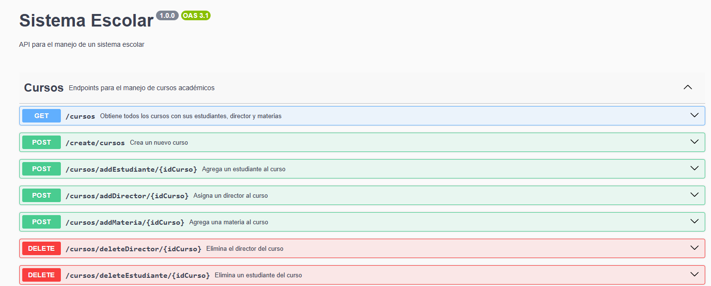

# API REST

## Endpoints
### Ruta para la documentacion
http://localhost:3000/docs

### Cursos
- GET /cursos
- POST /create/cursos
- POST /cursos/addEstudiante/{idCurso}
- POST /cursos/addDirector/{idCurso}
- POST /cursos/addMateria/{idCurso}
- DELETE /cursos/deleteEstudiante/{idCurso}/{idEstudiante}
- DELETE /cursos/deleteDirector/{idCurso}/{idProfesor}
- DELETE /cursos/deleteMateria/{idCurso}/{idMateria}
- PUT /cursos/edit/{idCurso}

### Estudiantes
- GET /estudiantes
- POST /create/estudiantes
- PUT /estudiantes/edit/{idEstudiante}

### Profesores
- GET /profesores
- POST /create/profesores
- PUT /profesores/edit/{idProfesor}

### Materias
- GET /materias
- POST /create/materias
- PUT /materias/edit/{idMateria}

